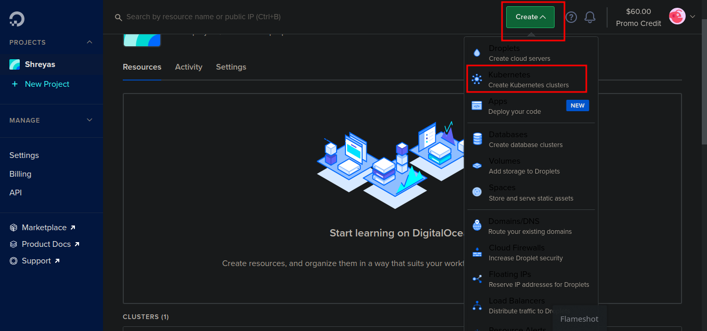
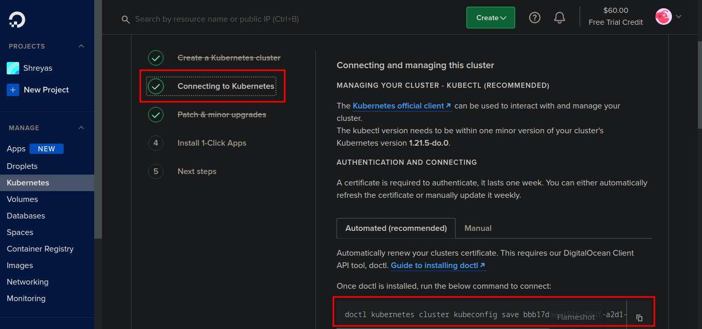
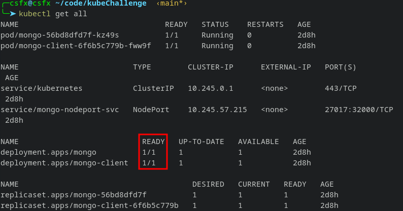
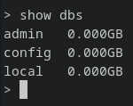

# DigitalOcean Kubernetes Challenge

## Deploy MongoDB Cluster on Kubernetes

## What is Kubernetes?
Kubernetes, also known as K8s, is an open-source system for automating deployment, scaling, and management of containerized applications.

*Note: I initally selected a different topic for the challenge but couldn't complete it so doing scalable mongodb (NoSql) deployment on kubernetes.*

## Depolyment Guide

### Prerequisites
- [Git installation guide](https://git-scm.com/book/en/v2/Getting-Started-Installing-Git)
- [kubectl installation guide](https://kubernetes.io/docs/tasks/tools/install-kubectl/)
- [doctl installation guide](https://docs.digitalocean.com/reference/doctl/how-to/install/#step-1-install-doctl)
- [DigitalOcean account](https://www.digitalocean.com/)

### Step 1: Create a Kubernetes cluster
Digital ocean makes it easier to create Kubernetes clusters.
- Head to [DigitalOcean](https://www.digitalocean.com/) and click on the **Kubernetes** button in **Create** dropdown button on the top right.
- Choose and fill in the following fields (side note: you can leave the fields unchanged for the challenge):
    - **Region**: Choose the region where you want to create your cluster.
    - **Name**: Choose a name for your cluster.
    - **Version**: Choose the version of Kubernetes you want to use.
    - **Node Pool**: Choose the node pool you want to use.
    side note: you can leave the fields as they are.
- Click on **Create** button.
- Wait until the cluster is created.

### Step 2: Connect to the cluster
- In the **Overview** tab, **Getting Started** section will have the required information.
- Go to second tab **Connecting to kubernetes** and copy the command to configure the cluster certificate/kubeconfig which looks something like `doctl kubernetes cluster kubeconfig`.
- Run the command in the terminal.

### Step 3: Deploy MongoDB Cluster
- Clone this [MongoDB Kubernetes Challenge Repo](https://github.com/csfx-py/DOproject) using `git clone https://github.com/csfx-py/DOproject.git`.
- Go to the repo directory
- Optional step: change the mongodb credentials:
    - Open **mongodb-secrets.yaml** file
    - Change the username and password with base64 encoded values.
    - Save the file.

- Run `kubectl apply -f .` to deploy the MongoDB cluster.
- Run `kubectl get all` to check the status of the deployment.
- Wait until the deployment is complete.

### Step 4: Verify the deployment
- Run `kubectl exec deployment/mongo-client -it -- /bin/bash` to connect to the MongoDB cluster.
- The prompt should change to *root@mongo-client-xxx*

    - Run `mongo --host mongo-nodeport-svc --port 27017 -u <username> -p <password>` where *username* and *password* are the decoded values for the base64 credentials you entered in **mongodb-secrets.yaml** file.
    - You should see the mongoDB info and prompt for mongo commands.

### Step 5: Celebrate
Congratulations! You have successfully deployed a MongoDB cluster on Kubernetes.

